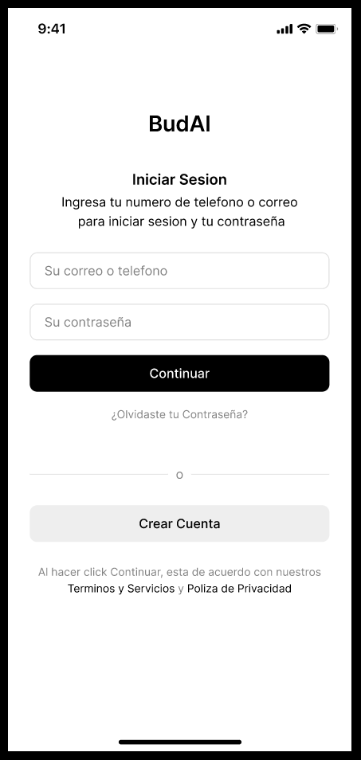
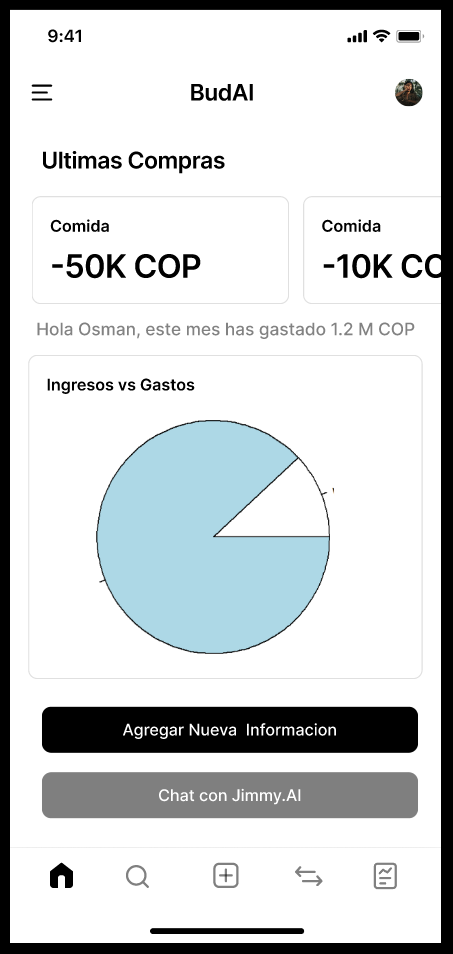
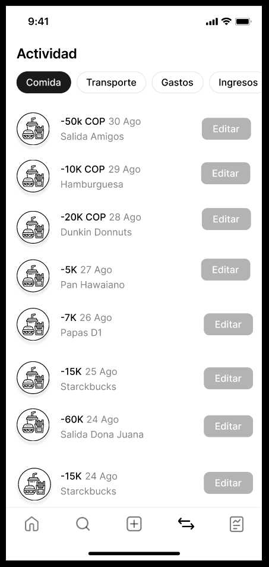
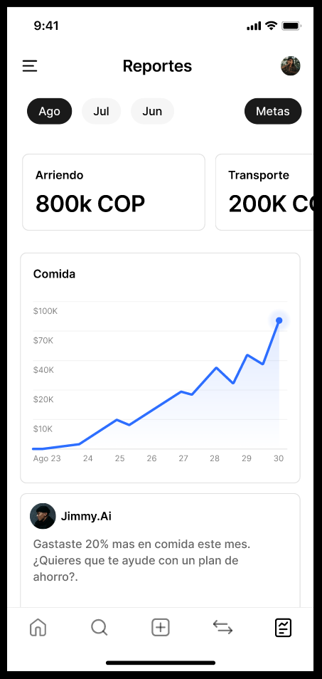
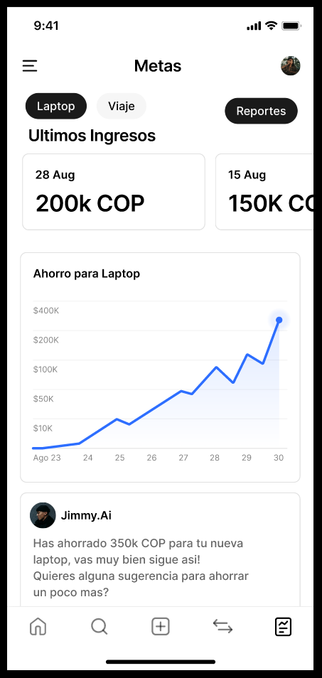
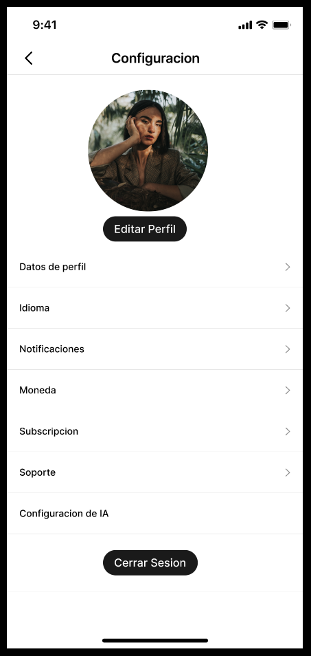
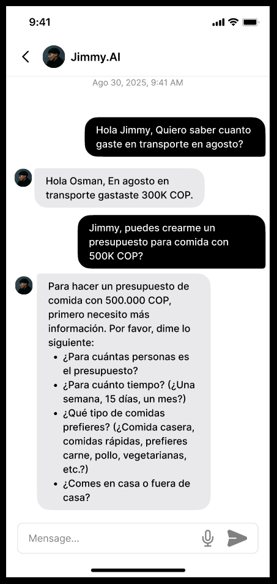

# Diseño de interfaz de usuario

La aplicación tendrá la siguientes pantallas

## 1. Pantalla 1: registro y login

## 2. Pantalla 2: home

## 3. Pantalla 3: test inicial

## 4. Pantalla : test inicial pt2

## 5. Pantalla 5: metas

## 6. Pantalla 6: rutina semanal

## 7. Pantalla 7: circuito

## 8. Pantalla 8: ejemplo del ejercvicio

## 9. Pantalla 9: recomendacion alimentaria

# Referencias

- [Material Design: Foundations](https://m3.material.io/foundations)
- [Material Design: Style](https://m3.material.io/styles)

-------

# Parte de otro proyecto No mirar
# Diseño de interfaz de usuario

La interfaz de usuario de la apliacion BudAi esta inspirada en la interfaz de usuario de aplicaciones similares. El diseno esta completo esta disponible en [Figma](https://www.figma.com/proto/0HCfLeTqpEHFKZVtIOBHdF/BudAI?node-id=4-138&t=k6D7hdRiVQqOMBLr-1&scaling=min-zoom&content-scaling=fixed&page-id=0%3A1&starting-point-node-id=4%3A138). Los colores estan basados en una combinacion de escala de grises, para mantener su tono minimalista y elegante. 

A continuación se presentan las principales pantallas:

## 1. Pantalla de Inicio de Sesión
Cuando el usuario abra la aplicacion tendra la opcion de iniciar sesion con su correo o telefono y su contrasena. Y si olvido su contrasena puede restablecerla.Ademas de que si no tiene cuenta puede crearla.

## 2. Pantalla de Registro
Para crear su cuenta el usuario debe ingresar su informacion tales como:
- Nombre y Apellido
- Numero de telefono o correo
- Su contrasena
- Confirmar su contrasena

Y con eso puede crear la cuenta. Y si ya tiene cuenta y le dio por accidente a esta opcion puede volver a iniciar sesion.

## 3. Pantalla para Restablecer Contraseña
El usuario que haya olvidado su contraseña puede restablecerla luego de verificar ciertos datos.

## 4. Pantalla Principal / Dashboard
Los usuario que hayan creado su cuenta o hayan iniciado sesion con exito. Seran enviados al dashboard, pagina principal. Desde aca tienen acceso al perfil/conffiguracion en la esquina derecha superior. Y a diferentes ocpiones en la barra inferior. Desde aca se accede a la pantalla 9 de chatbot con la IA financiera.

## 5. Pantalla de Transacciones
Desde este pantalla los usuarios pueden ver sus diferentes transacciones segun las diferentes categorias por default y creadas.

## 6. Pantalla de Reportes
En esta pantalla los usuarios pueden ver su reporte general mes a mes de sus transacciones, algun comentario de la IA. Y ademas se puede acceder a las metas.

## 7. Pantalla de Metas Financieras
En esta pantalla les permite crear metas de ahorro o presupuestos con su bot AI. Ademas de ver las metas  y que tanto se ha avanzdo a ellas.

## 8. Pantalla de Configuración
El usuario puede mofificar los parametros aqui visibles y editar su perfil. Y puede cerrar sesion.

## 9. Pantalla de Chat con BudAi (Asistente Financiero IA)
Un chatbot financiero con el que el usuario puede interactuar. 

# Referencias

- [Link Figma completo](https://www.figma.com/proto/0HCfLeTqpEHFKZVtIOBHdF/BudAI?node-id=4-138&t=1TFvb5MuafgJcCJZ-0&scaling=min-zoom&content-scaling=fixed&page-id=0%3A1&starting-point-node-id=4%3A138)

